<!--
  You read source comments.
  That's either a good sign or a concerning one.
  Probably both.
-->

<p align="center">
  
</p>

<p align="center">
  Not a student who codes.<br>
  A person who builds things to understand them — then breaks them to understand them better.
</p>

<p align="center">
  <a href="https://kattaharsha.dev">Portfolio</a>
  &nbsp;·&nbsp;
  <a href="#active-experiments">Experiments</a>
  &nbsp;·&nbsp;
  <a href="#current-questions">Current questions</a>
</p>

---

## Active experiments

| Project | In practice | State |
| :-- | :-- | :-- |
| [**TermNav**](https://npmjs.com/package/termnav) | Keyboard-driven terminal navigation | `published` |
| **SecureFile-X** | File and image encryption | `distrust is a feature` |
| **MorphStudio** | Graphics and vector work that outgrew a curiosity | `evolving` |
| **Nexis** | Distributed systems, because one machine was not enough | `in progress` |
| **Orbit** | An operating system from scratch | `ongoing · probably never done` |

## Operating loop

```text
encounter something confusing
        ↓
build the smallest version of it
        ↓
break it on purpose
        ↓
understand the failure
        ↓
rebuild it properly
        ↓
find the next confusing thing
```

## Current questions

- Where machine learning ends and systems engineering begins.
- How schedulers decide what deserves to run next.
- Why some abstractions hold — and others leak immediately.

## Current surface

<p>
  
  
  
  
  
  
  
  
</p>

---

<sub>AIML undergrad. Coursework gathers dust; experiments do not. The first thing that felt real was shipping TermNav to npm — still chasing that feeling.</sub>
